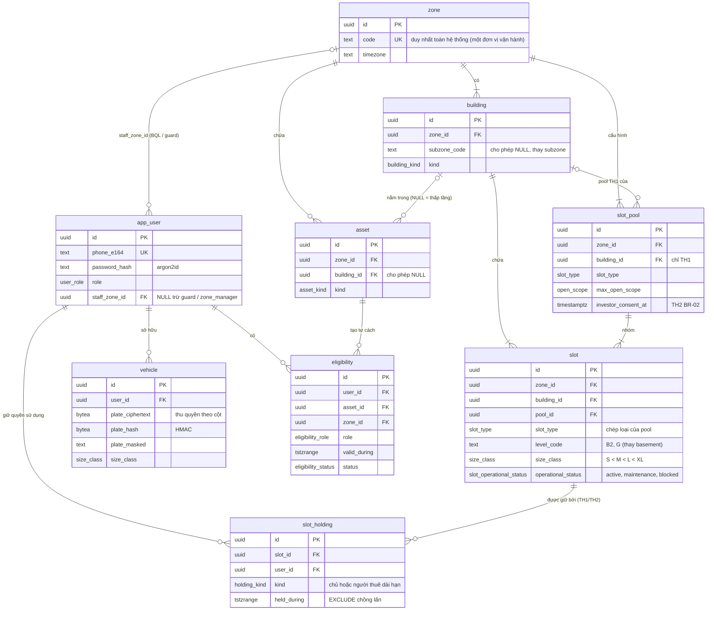

# ERD — Cơ sở vật chất, người dùng, tư cách

> Thuộc [02-erd](../02-erd.md) (ghi chú và chính sách ON DELETE ở đó). Cột: [từ điển dữ liệu](../03-data-dictionary.md).

```mermaid
erDiagram
    zone ||--|{ building : "có"
    zone ||--|{ slot_pool : "cấu hình"
    building |o--o{ slot_pool : "pool TH1 của"
    building ||--|{ slot : "chứa"
    slot_pool ||--|{ slot : "nhóm"

    app_user ||--o{ vehicle : "sở hữu"
    app_user ||--o{ eligibility : "có"
    asset ||--o{ eligibility : "tạo tư cách"
    zone ||--o{ asset : "chứa"
    building |o--o{ asset : "nằm trong (NULL = thấp tầng)"
    app_user ||--o{ slot_holding : "giữ quyền sử dụng"
    slot ||--o{ slot_holding : "được giữ bởi (TH1/TH2)"
    zone |o--o{ app_user : "staff_zone_id (BQL / guard)"

    zone {
        uuid id PK
        text code UK "duy nhất toàn hệ thống (một đơn vị vận hành)"
        text timezone
    }
    building {
        uuid id PK
        uuid zone_id FK
        text subzone_code "cho phép NULL, thay subzone"
        building_kind kind
    }
    slot_pool {
        uuid id PK
        uuid zone_id FK
        uuid building_id FK "chỉ TH1"
        slot_type slot_type
        open_scope max_open_scope
        timestamptz investor_consent_at "TH2 BR-02"
    }
    slot {
        uuid id PK
        uuid zone_id FK
        uuid building_id FK
        uuid pool_id FK
        slot_type slot_type "chép loại của pool"
        text level_code "B2, G (thay basement)"
        size_class size_class "S < M < L < XL"
        slot_operational_status operational_status "active, maintenance, blocked"
    }
    app_user {
        uuid id PK
        text phone_e164 UK
        text password_hash "argon2id"
        user_role role
        uuid staff_zone_id FK "NULL trừ guard / zone_manager"
    }
    asset {
        uuid id PK
        uuid zone_id FK
        uuid building_id FK "cho phép NULL"
        asset_kind kind
    }
    eligibility {
        uuid id PK
        uuid user_id FK
        uuid asset_id FK
        uuid zone_id FK
        eligibility_role role
        tstzrange valid_during
        eligibility_status status
    }
    slot_holding {
        uuid id PK
        uuid slot_id FK
        uuid user_id FK
        holding_kind kind "chủ hoặc người thuê dài hạn"
        tstzrange held_during "EXCLUDE chồng lấn"
    }
    vehicle {
        uuid id PK
        uuid user_id FK
        bytea plate_ciphertext "thu quyền theo cột"
        bytea plate_hash "HMAC"
        text plate_masked
        size_class size_class
    }
```
