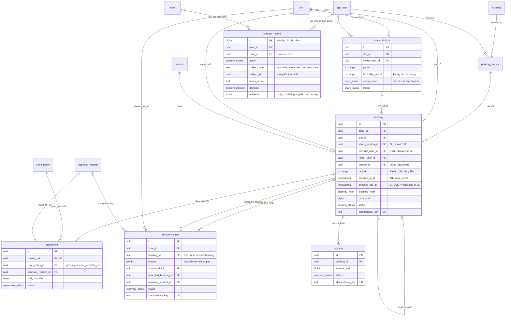

# ERD — Chia sẻ, đặt chỗ, thỏa thuận, bằng chứng, chủ về sớm, tiền

> Thuộc [02-erd](../02-erd.md) (ghi chú và chính sách ON DELETE ở đó). Cột: [từ điển dữ liệu](../03-data-dictionary.md).

```mermaid
erDiagram
    slot ||--o{ share_window : "chia sẻ trong"
    app_user ||--o{ share_window : "chủ"
    building ||--o{ parking_request : "yêu cầu tại"
    app_user ||--o{ parking_request : "yêu cầu"
    parking_request |o--o{ booking : "dẫn tới"
    slot ||--o{ booking : "giữ chỗ"
    share_window |o--o{ booking : "chỉ TH1/TH2"
    app_user ||--o{ booking : "người thuê"
    vehicle ||--o{ booking : "đỗ xe"
    booking |o--o| booking : "chuyển từ (W3)"
    booking ||--o| agreement : "được phủ bởi"
    zone_policy ||--o{ agreement : "ghim giá + mẫu"
    approval_request |o--o| agreement : "duyệt (BR-12)"
    app_user ||--o{ consent_record : "xác nhận (chỉ ghi thêm)"
    zone |o--o{ consent_record : "khu của đối tượng"
    booking ||--o{ recovery_case : "chủ về sớm (W3)"
    booking |o--o| recovery_case : "relocated_booking_id"
    slot |o--o{ recovery_case : "chosen_slot_id"
    approval_request |o--o{ recovery_case : "chuyển lên BQL"
    booking ||--o{ payment : "được trả bởi"

    share_window {
        uuid id PK
        uuid slot_id FK
        uuid owner_user_id FK
        tstzrange period
        tstzrange bookable_period "khung trừ dự phòng"
        open_scope open_scope "<= mức tối đa của pool"
        share_status status
    }
    booking {
        uuid id PK
        uuid zone_id FK
        uuid slot_id FK
        uuid share_window_id FK "NULL với TH3"
        uuid provider_user_id FK "= chủ khung chia sẻ"
        uuid renter_user_id FK
        uuid vehicle_id FK "thuộc người thuê"
        tstzrange period "EXCLUDE chồng lấn"
        timestamptz checked_in_at "N1, từ lpr_event"
        timestamptz checked_out_at "CHECK >= checked_in_at"
        eligibility_level eligibility_level
        bigint price_vnd
        booking_status status
        text idempotency_key UK
    }
    agreement {
        uuid id PK
        uuid booking_id FK,UK
        uuid zone_policy_id FK "giá + agreement_template_md"
        uuid approval_request_id FK
        bytea body_sha256
        agreement_status status
    }
    consent_record {
        bigint id PK "identity, chỉ ghi thêm"
        uuid user_id FK
        uuid zone_id FK "cho phép NULL"
        consent_action action
        text subject_type "app_user, agreement, recovery_case"
        uuid subject_id "không FK (đa hình)"
        text terms_version
        consent_decision decision
        jsonb evidence "body_sha256, giá, phiên bản nội quy"
    }
    recovery_case {
        uuid id PK
        uuid zone_id FK
        uuid booking_id FK "một hồ sơ mở mỗi booking"
        jsonb options "ứng viên từ rule engine"
        uuid chosen_slot_id FK
        uuid relocated_booking_id FK
        uuid approval_request_id FK
        recovery_status status
        text idempotency_key UK
    }
    payment {
        uuid id PK
        uuid booking_id FK
        bigint amount_vnd
        payment_status status
        text idempotency_key UK
    }
```
