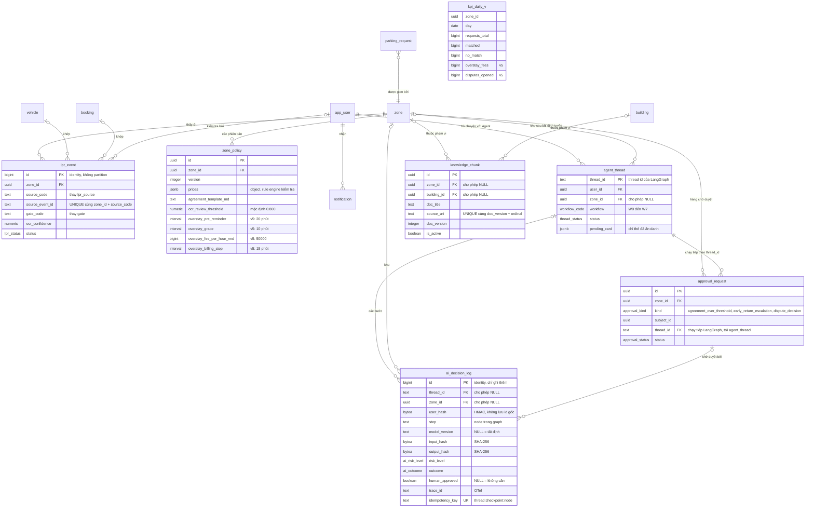

# ERD — Vận hành: LPR, duyệt, thread Agent, kiểm toán AI, báo cáo

> Thuộc [02-erd](../02-erd.md) (ghi chú và chính sách ON DELETE ở đó). Cột: [từ điển dữ liệu](../03-data-dictionary.md).

```mermaid
erDiagram
    zone ||--o{ lpr_event : "thấy ở"
    vehicle |o--o{ lpr_event : "khớp"
    booking |o--o{ lpr_event : "khớp"
    app_user |o--o{ lpr_event : "kiểm tra bởi"

    zone ||--o{ approval_request : "hàng chờ duyệt"
    zone ||--o{ zone_policy : "các phiên bản"
    app_user ||--o{ notification : "nhận"
    app_user ||--o{ agent_thread : "trò chuyện với Agent"
    zone |o--o{ agent_thread : "khu sau khi định tuyến"
    agent_thread ||--o{ approval_request : "chạy tiếp theo thread_id"
    agent_thread |o--o{ ai_decision_log : "các bước"
    zone |o--o{ ai_decision_log : "khu"
    approval_request |o--o{ ai_decision_log : "chờ duyệt bởi"
    zone |o--o{ knowledge_chunk : "thuộc phạm vi"
    building |o--o{ knowledge_chunk : "thuộc phạm vi"
    parking_request }o--|| zone : "được gom bởi"

    lpr_event {
        bigint id PK "identity, không partition"
        uuid zone_id FK
        text source_code "thay lpr_source"
        text source_event_id "UNIQUE cùng zone_id + source_code"
        text gate_code "thay gate"
        numeric ocr_confidence
        lpr_status status
    }
    approval_request {
        uuid id PK
        uuid zone_id FK
        approval_kind kind "agreement_over_threshold, early_return_escalation, dispute_decision"
        uuid subject_id
        text thread_id FK "chạy tiếp LangGraph, tới agent_thread"
        approval_status status
    }
    agent_thread {
        text thread_id PK "thread id của LangGraph"
        uuid user_id FK
        uuid zone_id FK "cho phép NULL"
        workflow_code workflow "W0 đến W7"
        thread_status status
        jsonb pending_card "chỉ thẻ đã ẩn danh"
    }
    ai_decision_log {
        bigint id PK "identity, chỉ ghi thêm"
        text thread_id FK "cho phép NULL"
        uuid zone_id FK "cho phép NULL"
        bytea user_hash "HMAC, không lưu id gốc"
        text step "node trong graph"
        text model_version "NULL = tất định"
        bytea input_hash "SHA-256"
        bytea output_hash "SHA-256"
        ai_risk_level risk_level
        ai_outcome outcome
        boolean human_approved "NULL = không cần"
        text trace_id "OTel"
        text idempotency_key UK "thread:checkpoint:node"
    }
    zone_policy {
        uuid id PK
        uuid zone_id FK
        integer version
        jsonb prices "object, rule engine kiểm tra"
        text agreement_template_md
        numeric ocr_review_threshold "mặc định 0.800"
        interval overstay_pre_reminder "v5: 20 phút"
        interval overstay_grace "v5: 10 phút"
        bigint overstay_fee_per_hour_vnd "v5: 50000"
        interval overstay_billing_step "v5: 15 phút"
    }
    knowledge_chunk {
        uuid id PK
        uuid zone_id FK "cho phép NULL"
        uuid building_id FK "cho phép NULL"
        text doc_title
        text source_uri "UNIQUE cùng doc_version + ordinal"
        integer doc_version
        boolean is_active
    }
    kpi_daily_v {
        uuid zone_id
        date day
        bigint requests_total
        bigint matched
        bigint no_match
        bigint overstay_fees "v5"
        bigint disputes_opened "v5"
    }
```
