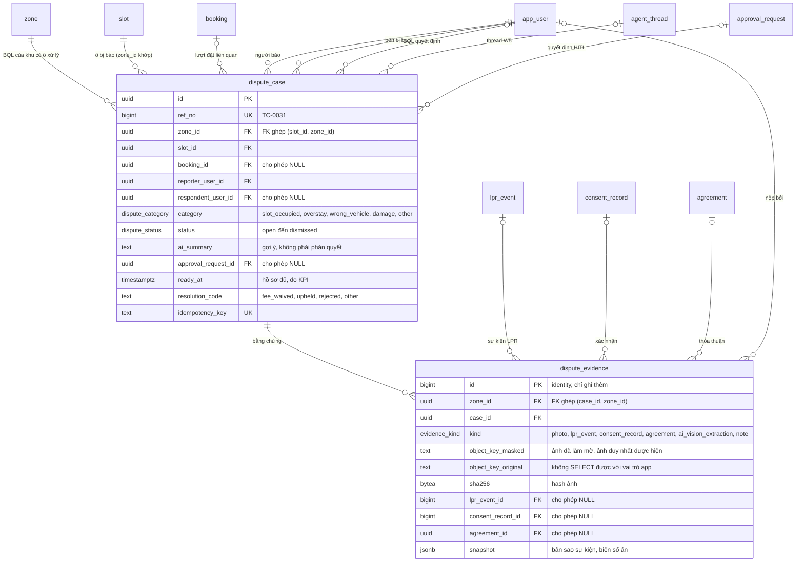

# ERD — Tranh chấp (v5, M10, W5)

> Thuộc [02-erd](../02-erd.md) (ghi chú và chính sách ON DELETE ở đó). Cột: [từ điển dữ liệu](../dictionary/09-disputes.md).

```mermaid
erDiagram
    zone ||--o{ dispute_case : "BQL của khu có ô xử lý"
    slot ||--o{ dispute_case : "ô bị báo (zone_id khớp)"
    booking |o--o{ dispute_case : "lượt đặt liên quan"
    app_user ||--o{ dispute_case : "người báo"
    app_user |o--o{ dispute_case : "bên bị báo"
    app_user |o--o{ dispute_case : "BQL quyết định"
    agent_thread |o--o{ dispute_case : "thread W5"
    approval_request |o--o{ dispute_case : "quyết định HITL"

    dispute_case ||--o{ dispute_evidence : "bằng chứng"
    lpr_event |o--o{ dispute_evidence : "sự kiện LPR"
    consent_record |o--o{ dispute_evidence : "xác nhận"
    agreement |o--o{ dispute_evidence : "thỏa thuận"
    app_user |o--o{ dispute_evidence : "nộp bởi"

    dispute_case {
        uuid id PK
        bigint ref_no UK "TC-0031"
        uuid zone_id FK "FK ghép (slot_id, zone_id)"
        uuid slot_id FK
        uuid booking_id FK "cho phép NULL"
        uuid reporter_user_id FK
        uuid respondent_user_id FK "cho phép NULL"
        dispute_category category "slot_occupied, overstay, wrong_vehicle, damage, other"
        dispute_status status "open đến dismissed"
        text ai_summary "gợi ý, không phải phán quyết"
        uuid approval_request_id FK "cho phép NULL"
        timestamptz ready_at "hồ sơ đủ, đo KPI"
        text resolution_code "fee_waived, upheld, rejected, other"
        text idempotency_key UK
    }
    dispute_evidence {
        bigint id PK "identity, chỉ ghi thêm"
        uuid zone_id FK "FK ghép (case_id, zone_id)"
        uuid case_id FK
        evidence_kind kind "photo, lpr_event, consent_record, agreement, ai_vision_extraction, note"
        text object_key_masked "ảnh đã làm mờ, ảnh duy nhất được hiện"
        text object_key_original "không SELECT được với vai trò app"
        bytea sha256 "hash ảnh"
        bigint lpr_event_id FK "cho phép NULL"
        bigint consent_record_id FK "cho phép NULL"
        uuid agreement_id FK "cho phép NULL"
        jsonb snapshot "bản sao sự kiện, biển số ẩn"
    }
```
